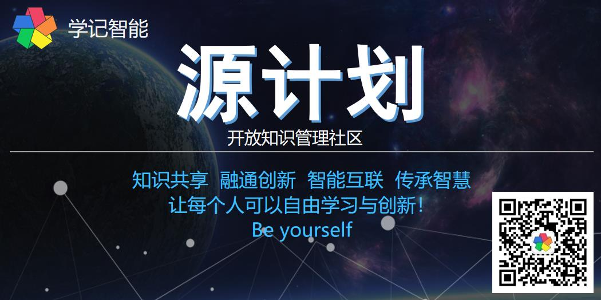

## 目录

- [我们是 Who](#👽-我们是-Who?)
- [为什么 Why](#🚀-为什么-Why?)
- [怎样做 How](#🎯-怎样做-How?)
- [参与贡献](#🤝-参与贡献)
  - [工作组](#📡-工作组及研究方向)
  - [项目列表](#⭐-项目列表)
- [基本原则](#💎-基本原则)
- [向贡献者致谢](#💜-致谢)
- [知识产权](#📄-知识产权)
- [联系加入](#📞-联系)

## 👽 我们是 Who?

我们是一个协同学习型组织，专注智能知识管理，创建知识之源！目标是成为全球最大的协同学习与创新社区！🌏

- **价值主张**： 大道至简、以人为本，从知识管理应用切入，以扩展人的能力为目的，开发智能协同工具系统，通过人类计算（众包）的方式，人机协作挖掘人类知识金矿，探究知识及智能本质，整合各领域知识及关联，移除知识与协作的鸿沟，协同积累知识与创新。把人从信息爆炸及繁琐重复的劳动中解放出来，从事自己热爱的、更具创造性的劳动！
- **理念**：开放（团结一切可以团结的力量，融合各种优秀思想）、协作（共同信念集体智慧）、共享（知识共享）、共赢（共同利益、按贡献分配）、创新（资源重组创造价值），教学理念（因材施教、整体混合学习、学以致用）。
- **使命**： 知识共享、融通创新、智能互联、传承智慧！让每个人可以自由学习与创新，做自己！Be yourself!

## 🚀 为什么 Why?

以人为本实现应对人工智能  
 

- **知识财富**，积累知识胜过积累金钱，知识是人类进步的阶梯。是个人及企业的核心竞争力
- **化繁为简**，发现模式化繁为简，挖掘本质及关联，知其然知其所以然，促进融合创新
- **人类智慧**，挖掘隐性知识、理解人类多元智能，发掘利用大脑潜力，挑战认知极限
- **知识传播**，探索新的知识存储展示分享方式，建立高效沟通协同与积累分享的基础
- **实现应对人工智能**，知识与智能相辅相成，知识管理应用以人为本凝聚社区促进技术，形成闭环
- **重新造轮子**，是为自己开发一个工具，支持高效学习与创新
- **作为事业**，一项值得奋斗十年的事业。

> Do something diferent, make a change! 

## 🎯 怎样做 How?

**一个最佳组合**：人工智能+知识管理+开源项目+人类计算。基于共同的知识需求，通过[开源项目](#⭐-项目列表)结合产学研，开发智能工具支持社群协同，促进知识协作与共享。通过众包集体智慧完善产品及技术，形成闭环，从知识管理探索实现通用智能。我们认为这是实现应和对人工智能的最佳途径！

 
KM:知识管理，P:人，+:工具系统，K:知识，S:社群共享

**从知识管理到人工智能**  
 

### 🍀 组织形式：敏捷协作的网络化工作组

- **热爱胜于金钱**：动机、情感、激励、责任
- **发挥群体力量**：分享、合作和集体行动
- **建立网络规则**：承诺、工具和协议

将社区视为一个灵活的自组织网络，结构基于职能和项目，聚焦产品、通过共同信念合作、知识共享激发能量，扁平化管理、共同制定完善规则，基于智能系统按项目**自由分工协作**，任人唯贤、能者居上、各尽其职、扁平管理，按贡献分配激励，发挥集体智慧、维护共同利益。

- **组成**：社会企业、开放社群、工作组、贡献者
- **工作组**：5 个核心成员、1 个协调管理、n个贡献者组成，一个人可以加入多个工作组
- **角色**：项目组负责人、工作组负责人、工作组成员、普通成员、用户
- **系统**：智能化实时协作平台、基于区块链的（贡献积分系统、个人信息安全、知识产权保护系统）
- **产出**：线上线下活动、开源项目产品、内容创作
- **分配**：按贡献分配，智点（贡献水平、可交易）、学分（学识水平）、级别勋章

### 🤝 加入

- **加入**：产生成员代号 M001（M 3 位十六进制）
- **初期奖励规则**：前 200 名送 1000 永久贡献积分，获得工具的终身免费高级会员
- **邀请规则**：邀请一人 +10 分，及其贡献积分的 1% 提成
- **职责**：宣传践行组织理念、积极参与贡献，维护组织共同利益
- **权益**：参与修订规则、发布需求、共享知识及资源、按贡献积分规则获得智点、免费工具、发展人脉

## 💎 基本原则

- 大道至简，以人为本
- 整体大于部分之和，融合统一集成
- 人类计算：集体智慧+人机结合
- 以不变应万变：先统一抽象再个性化
- 二元三层五度一体递归迭代
- 单一源、可持续：不断接近目标

## 👊 参与贡献

这是一项长期而艰巨的事业，我们希望团结一切可以团结的力量，努力使任何人可随时随地参与贡献，欢迎各类认同社区价值的学习者、创新者加入贡献力量一同成长，一起实现梦想、共创未来！💪

- 选择工作组→选择项目→选择角色→明确职责→开始贡献
- **欢迎贡献自己的相关开源项目**
- 分享知识，提供各类资源
- 提交或投票新功能特性[需求](http://xuejiai.com)
- 更多方式请参考具体项目的贡献说明文档
- 欢迎提出各种意见建议，提交[pull requests](https://github.com/kmagent/kmagent/pulls) 及 [issue](https://github.com/kmagent/kmagent/issues)。
- 【💰 捐赠】如果您认同我们请支持我们快速持续发展。

**贡献申请** 👉 [http://xuejiai-org.mikecrm.com/Z5BuYsE][3]
---

### 📡 工作组及研究方向

- WG001 企业组：企业建设（商业模式）、企业运营管理、营销、项目管理、过程改进、投资财务
- WG002 理论组：元理论、通用智能、智能伦理、知识表示与推理、语义模型、知识框架、认知科学、复杂系统
- WG003 产品组：需求管理、产品设计、产品运营、人机交互与协作、知识可视化、安全、竞品分析
- WG004 算法组：自然语言理解、知识图谱、深度学习、集群智能、知识发现、区块链、机器视觉
- WG005 开发组：微服务架构、前端后端技术、大数据、虚拟化云计算、软件工程
- WG006 业务组：智能知识管理（业务建模、解决方案、培训咨询）、行业研究、业务合作
- WG007 社群组：社区管理、活动策划、社群经济、需求对接、项目合作、技术转移、世界咖啡汇谈、**参加相关比赛**
- WG008 内容组：新媒体、前沿资讯、发布宣传项目、社区进展、方法模板工具最佳实践整理、知识创作分享。
- WG009 用户组：深度使用产品、提供需求建议、协作分享知识、宣传产品

### ⭐ 项目列表

> 欢迎贡献自己的相关开源项目一起完善

- P000 元理论：我们的基础理论假设，元按规则关联导致混沌展现模式涌现智能（结构-活性-能动性）
  - 智能：有原则有目的、假设犯错仿真、反馈、自指、能感而发、渐进决策、自组织自完善、学习进化、创新、知识能力一体、趋利避害，解决问题满足需求。
- P001 打造社会企业：专注教育智能化，提供专业知识服务
- P002 源计划社区：开放社区建设，跨学科聚合、人类计算（协同机制、项目众包）
- P003 **智能文档**：🔥 【第一款产品】协同知识管理平台，基于语义、知识图谱、智能助理，打造新一代知识载体及人机交互接口）  
  - 首先用于支持社区协同建立核心概念体系、构建开放知识图谱，初步支持智能知识管理业务、时间精力管理 GTD 工具
- P004 智能助理：数字化平行人、虚拟形象、客服、智能引擎
  
- P005 领域语言：DSL、交互、命令、编程
- P006 虚拟空间：虚拟化、游戏化、VR、人类计算
- P007 贡献积分系统：经济系统、区块链
- P008 开放知识图谱：领域知识图谱、百科 wiki、图数据库、大数据分析
- P009 学习与知识管理系统：现代化移动学习、知识协作与培训管理平台
- P00A 智能硬件：机器人终端、物联网
- P00B 线下空间：🍮 Tea AI Coffee

## 💜 致谢

感谢所有促进社区发展的 [贡献者](https://github.com/xuejiai/org/contributors.md) 和 [深度用户](https://github.com/xuejiai/org/fans.md)

## 相关文档

| | | | |
|:---:|:---:|:---:|:---:|
| [**社区共识**][4] | [**社区章程**][4] | [**贡献指南**][4] | [**贡献者协议**][4]|
|[**贡献积分规则**][4] | **贡献者列表** | **社区运营记录** | **知识管理**|

## 📄 知识产权

> 为了保障社区共同利益，新相关规则制定之前，各类知识产权（专利、商标、源码等）归“山东学记智能科技有限公司”所有。

文档内容：CC-BY-SA [知识共享许可协议](http://creativecommons.org/licenses/by-sa/3.0/cn)  
项目源码：许可协议 [MIT](./LICENSE)

## 📞 联系

> 关注公众号或加入微信群以获取最新消息及文章、参与讨论、联系加入我们。

微信群：这里汇集了不同专业领域的人才，展开各种形式的交流合作，发现新思想、新理念，协同积累分享知识，合作学习与创新，互助让想法与梦想成为现实。

入群交流，请添加微信 hua471350，备注：aikm 社区群；  
提交贡献申请: [http://xuejiai-org.mikecrm.com/Z5BuYsE][3]

- 个人微信：  
 

- 公众号：  
 

- **网站**：[http://xuejiai.com][1]
- GitHub： [github.com/xuejiai][2]

😺 **期待您的加入！**
---

---

> - **深刻思考、精简知识、智能工具、高效协同、传承智慧创新未来！**

> - *幸福在于知足常乐、适可而止、懂得珍惜、记得感恩。从心而为成为自己！*

> - **大道至简**：大道理是极其简单的，简单到一两句话就能说明白。一门技术或学问，弄得很深奥是因为没有看穿实质，搞的很复杂是因为没有抓住关键，反而陶醉在自我制造的复杂中不能自拔。大道至简是人类认知世界过程中通过实践思考总结出的最根本哲学规律，在文明的历史中，人们有一种朴素的愿望：“世界是统一的”。

 本作品采用<a rel="license" href="http://creativecommons.org/licenses/by-sa/3.0/cn/">知识共享署名-相同方式共享 3.0 中国大陆许可协议</a>进行许可。

[1]: http://xuejiai.com
[2]: https://github.com/xuejiai
[3]: http://xuejiai-org.mikecrm.com/Z5BuYsE
[4]: ./001-社区章程.md
